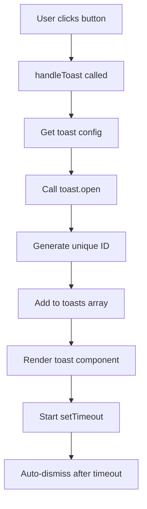
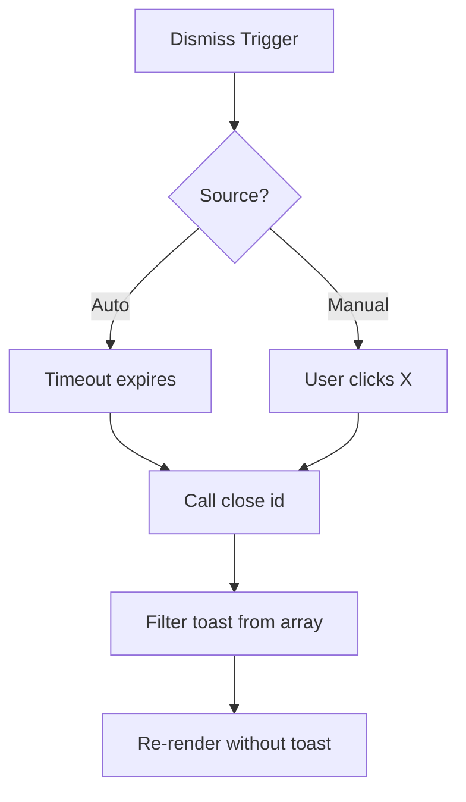

# Toast Notification System

A fully-typed, customizable toast notification system built with React, TypeScript, and Tailwind CSS.

## 📋 Table of Contents
- [Overview](#overview)
- [Features](#features)
- [Architecture](#architecture)
- [High-Level Design (HLD)](#high-level-design-hld)
- [Component Flow](#component-flow)
- [Installation](#installation)
- [Usage](#usage)
- [API Reference](#api-reference)
- [TypeScript Types](#typescript-types)
- [Customization](#customization)

## 🎯 Overview

A lightweight, production-ready toast notification system that provides:
- Type-safe implementation with TypeScript
- Context API for global state management
- Auto-dismiss functionality
- Multiple toast types (success, warning, error, info)
- Smooth animations with Tailwind CSS
- Customizable timeout and styling

## ✨ Features

- ✅ **Type-Safe**: Full TypeScript support
- ✅ **Context-Based**: Global toast management using React Context
- ✅ **Auto-Dismiss**: Configurable timeout for each toast
- ✅ **Multiple Types**: Success, Warning, Error, Info
- ✅ **Customizable**: Easy to style and extend
- ✅ **Accessible**: Proper ARIA labels and keyboard support
- ✅ **Responsive**: Works on all screen sizes
- ✅ **Lightweight**: Minimal dependencies

## 🏗️ Architecture

### Project Structure
```
src/
├── Toast/
│   ├── ToastProvider.tsx    # Main provider component
│   ├── ToastService.ts       # Context and hook
│   └── types.ts              # TypeScript definitions
├── helper/
│   └── helper.ts             # Utility functions
├── App.tsx                   # Demo application
└── main.tsx                  # Entry point
```

### Component Hierarchy
```
main.tsx
  └── ToastProvider (Context Provider)
      └── App (Consumer)
          └── Toast Notifications (Rendered)
```

## 📐 High-Level Design (HLD)

### System Components

```
┌─────────────────────────────────────────────────────────┐
│                     Application                          │
│  ┌───────────────────────────────────────────────────┐  │
│  │            ToastProvider (Context)                 │  │
│  │  ┌─────────────────────────────────────────────┐  │  │
│  │  │         State Management                     │  │  │
│  │  │  - toasts: Toast[]                          │  │  │
│  │  │  - open(component, timeout)                 │  │  │
│  │  │  - close(id)                                │  │  │
│  │  └─────────────────────────────────────────────┘  │  │
│  │                                                     │  │
│  │  ┌─────────────────────────────────────────────┐  │  │
│  │  │         Child Components                     │  │  │
│  │  │  - Can access toast via useToast()          │  │  │
│  │  └─────────────────────────────────────────────┘  │  │
│  │                                                     │  │
│  │  ┌─────────────────────────────────────────────┐  │  │
│  │  │      Toast Container (Fixed Position)       │  │  │
│  │  │  - Renders all active toasts                │  │  │
│  │  │  - Bottom-right corner                      │  │  │
│  │  │  - Stacked vertically                       │  │  │
│  │  └─────────────────────────────────────────────┘  │  │
│  └───────────────────────────────────────────────────┘  │
└─────────────────────────────────────────────────────────┘
```

### Data Flow

```
User Action (Button Click)
        ↓
   handleToast(type)
        ↓
   toast.open(component, timeout)
        ↓
   Generate Unique ID
        ↓
   Add to toasts array
        ↓
   Render Toast Component
        ↓
   Start Timeout Timer
        ↓
   Auto-dismiss after timeout
        ↓
   Remove from toasts array
```

## 🔄 Component Flow

### 1. Initialization Flow

```mermaid
graph TD
    A[main.tsx] --> B[ToastProvider]
    B --> C[Initialize Context]
    C --> D[Create State: toasts = []]
    D --> E[Provide open & close methods]
    E --> F[Render Children]
    F --> G[Render Toast Container]
```

### 2. Toast Creation Flow



### 3. Toast Dismissal Flow



## 📊 State Management

### Toast State Structure

```typescript
interface Toast {
  id: string;              // Unique identifier
  component: ReactNode;    // Toast content
}

// State
const [toasts, setToasts] = useState<Toast[]>([]);

// Example state:
[
  {
    id: "lx3k2m-abc123",
    component: <div>Success message</div>
  },
  {
    id: "lx3k2n-def456",
    component: <div>Error message</div>
  }
]
```

## 🚀 Installation

```bash
# Clone the repository
git clone <repo-url>

# Install dependencies
npm install
# or
yarn install

# Run development server
npm run dev
# or
yarn dev
```

## 💻 Usage

### Basic Setup

```tsx
// main.tsx
import { ToastProvider } from './Toast/ToastProvider';
import App from './App';

createRoot(document.getElementById('root')!).render(
  <ToastProvider>
    <App />
  </ToastProvider>
);
```

### Using Toast in Components

```tsx
import { useToast } from './Toast/ToastService';

function MyComponent() {
  const toast = useToast();

  const showSuccess = () => {
    toast.open(
      <div className="bg-green-500 text-white p-4 rounded-lg">
        <h3>Success!</h3>
        <p>Operation completed successfully</p>
      </div>,
      5000 // Optional: timeout in ms (default: 5000)
    );
  };

  return <button onClick={showSuccess}>Show Toast</button>;
}
```

### Toast Types Example

```tsx
const TOAST_CONFIG = {
  success: {
    icon: <CheckCircle />,
    bgColor: "bg-green-500",
    title: "Success"
  },
  error: {
    icon: <AlertCircle />,
    bgColor: "bg-red-600",
    title: "Error"
  },
  warning: {
    icon: <AlertTriangle />,
    bgColor: "bg-yellow-400",
    title: "Warning"
  },
  info: {
    icon: <Info />,
    bgColor: "bg-blue-500",
    title: "Info"
  }
};

function showToast(type: ToastType) {
  const config = TOAST_CONFIG[type];
  toast.open(
    <div className={`${config.bgColor} text-white p-4 rounded-lg`}>
      {config.icon}
      <h3>{config.title}</h3>
      <p>Your message here</p>
    </div>
  );
}
```

## 📚 API Reference

### ToastProvider

**Props:**
- `children: ReactNode` - Child components that can access toast

**Provides:**
- `open(component, timeout?)` - Show a toast
- `close(id)` - Dismiss a specific toast

### useToast Hook

```typescript
const toast = useToast();

// Methods
toast.open(component: ReactNode, timeout?: number): void
toast.close(id: string): void
```

**Parameters:**
- `component`: React component to render as toast
- `timeout`: Auto-dismiss time in milliseconds (default: 5000)
- `id`: Unique identifier for the toast

**Returns:**
- `ToastContextType` object with `open` and `close` methods

**Throws:**
- Error if used outside ToastProvider

### Helper Functions

```typescript
// Generate unique ID for toasts
generateUniqueId(): string
```

## 🔤 TypeScript Types

```typescript
// Toast type variants
export type ToastType = 'success' | 'warning' | 'error' | 'info';

// Individual toast structure
export interface Toast {
  id: string;
  component: React.ReactNode;
}

// Context type
export interface ToastContextType {
  open: (component: React.ReactNode, timeout?: number) => void;
  close: (id: string) => void;
}
```

## 🎨 Customization

### Custom Toast Component

```tsx
const CustomToast = ({ title, message, type }) => (
  <div className={`p-4 rounded-lg shadow-lg ${getColorClass(type)}`}>
    <div className="flex items-center gap-3">
      <Icon type={type} />
      <div>
        <h3 className="font-bold">{title}</h3>
        <p className="text-sm">{message}</p>
      </div>
    </div>
  </div>
);

// Usage
toast.open(<CustomToast title="Hello" message="World" type="success" />);
```

### Custom Positioning

```tsx
// In ToastProvider.tsx, modify the container div:
<div className="space-y-2 absolute top-4 left-4 z-50">
  {/* Top-left */}
</div>

<div className="space-y-2 absolute top-4 right-4 z-50">
  {/* Top-right */}
</div>

<div className="space-y-2 absolute bottom-4 left-4 z-50">
  {/* Bottom-left */}
</div>
```

### Custom Timeout

```tsx
// Short duration (2 seconds)
toast.open(<MyToast />, 2000);

// Long duration (10 seconds)
toast.open(<MyToast />, 10000);

// No auto-dismiss (pass Infinity)
toast.open(<MyToast />, Infinity);
```

## 🔧 Technical Details

### ID Generation Algorithm

```typescript
function generateUniqueId(): string {
  const timestamp = Date.now().toString(36);  // Base-36 timestamp
  const random = Math.random().toString(36).substring(2, 10);  // Random string
  return `${timestamp}-${random}`;  // Combine for uniqueness
}

// Example output: "lx3k2m-abc123def"
```

### Auto-Dismiss Mechanism

```typescript
const open = (component: ReactNode, timeout = 5000) => {
  const id = generateUniqueId();
  setToasts((toasts) => [...toasts, { id, component }]);
  
  // Schedule auto-dismiss
  setTimeout(() => close(id), timeout);
};
```

### Close Button Implementation

```tsx
<button
  onClick={() => close(id)}
  className="absolute top-2 right-2 p-1 rounded-lg"
  aria-label="Close toast"
>
  <X size={16} />
</button>
```

## 🐛 Bug Fixes Applied

### 1. Missing Return Statement
**Before:**
```tsx
{toasts.map(({ id, component }) => {
  <div key={id}>...</div>;  // ❌ No return
})}
```

**After:**
```tsx
{toasts.map(({ id, component }) => (
  <div key={id}>...</div>  // ✅ Implicit return
))}
```

### 2. Missing TypeScript Types
**Before:**
```tsx
const ToastProvider = ({ children }) => {  // ❌ No types
  const [toasts, setToasts] = useState([]);  // ❌ No type
```

**After:**
```tsx
const ToastProvider = ({ children }: ToastProviderProps) => {  // ✅
  const [toasts, setToasts] = useState<Toast[]>([]);  // ✅
```

### 3. Missing Component Rendering
**Before:**
```tsx
<div key={id}>
  <button>X</button>
  {/* ❌ component not rendered */}
</div>
```

**After:**
```tsx
<div key={id}>
  <button>X</button>
  {component}  {/* ✅ Rendered */}
</div>
```

### 4. Context Type Safety
**Before:**
```tsx
const ToastContext = createContext(null);  // ❌ No type
const useToast = () => useContext(ToastContext);  // ❌ Can be null
```

**After:**
```tsx
const ToastContext = createContext<ToastContextType | null>(null);  // ✅
const useToast = (): ToastContextType => {  // ✅
  const context = useContext(ToastContext);
  if (!context) throw new Error("...");  // ✅ Null check
  return context;
};
```

## 🎯 Best Practices

1. **Always wrap app with ToastProvider**
2. **Use TypeScript types for type safety**
3. **Keep toast messages concise**
4. **Use appropriate toast types**
5. **Don't show too many toasts simultaneously**
6. **Provide clear close buttons**
7. **Use reasonable timeout values**

## 🔍 Troubleshooting

### Toast not showing?
- Ensure ToastProvider wraps your component
- Check z-index conflicts
- Verify toast.open() is being called

### TypeScript errors?
- Import types from './Toast/types'
- Ensure proper type annotations
- Check ToastProvider is properly typed

### Toasts not dismissing?
- Check timeout value is reasonable
- Verify setTimeout is not being cleared
- Check for JavaScript errors in console

## 📈 Performance Considerations

- **Unique IDs**: Prevents React key conflicts
- **Functional Updates**: Uses functional setState for consistency
- **Minimal Re-renders**: Only affected toasts re-render
- **Cleanup**: Automatic cleanup via setTimeout

## 🚀 Future Enhancements

- [ ] Toast queue management
- [ ] Animation transitions
- [ ] Sound notifications
- [ ] Persistent toasts
- [ ] Toast history
- [ ] Custom animations
- [ ] Swipe to dismiss
- [ ] Progress bar
- [ ] Action buttons
- [ ] Toast stacking limits

## 📄 License

MIT

## 👥 Contributing

Contributions welcome! Please follow TypeScript best practices and maintain test coverage.

---

**Built with ❤️ using React, TypeScript, and Tailwind CSS**
